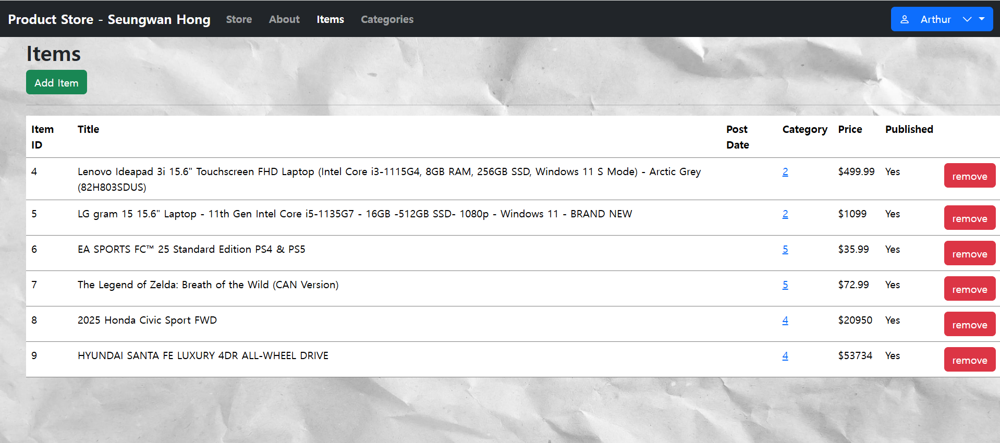

# 🏪 __Product Store__

Welcome to __Product Store!__ This is a web application built using __Node.js__ and __Express.js__ with user authentication, item and category management, and cloud-based file uploads.

## 🚀 __Features__

### 🔐 __Authentication__

* Users can __register__ and __log in__. 

* Non-logged-in users can only access __Store__ and __About__ pages.

* Logged-in users can access all pages and manage items and categories.

### 🏬 __Store Page__

* Displays a list of available products.

* Logged-in users can __add__ or __remove__ products.

### ℹ️ __About Page__

* A simple page displaying information about the store or the developer.

### 📦 __Item Management__

* Users can __add__ new items via an __Add Item__ button.

* Each item can be __removed__ using a __Remove button__.

* Items are __stored in the database__ and persist across sessions.

### 🏷️ __Category Management__

* Users can __add__ categories with an __Add Category__ button.

* Categories are listed with a __Remove__ button to delete them.

* Clicking a category name displays __items under that category.__

### 🛠️ __Technologies Used__

* __Express.js__ - Web framework

* __Multer & Cloudinary__ - File uploads

* __Client-sessions__ - User session management

* __Strip-js__ - Security for input sanitization

* __Database (e.g., MongoDB/MySQL)__ - Stores user and product data

## 📦 **Installation & Setup**  
1. Clone the repository:  
   ```bash
   git clone https://github.com/your-username/product-store.git
   cd product-store

2. Install dependencies:
   ```bash
   npm install

3. Set up environment variables:
   ```bash
   PORT=8080
   CLOUDINARY_URL=your_cloudinary_url
   DATABASE_URL=your_database_url  

4. Start the server:
   ```bash
   npm server.js

5. Open the application in your browser at:
   ```bash
   http://localhost:8080
   

## 📷 __Screenshots__
__Store Page__


__Item Page__


__Login History__

